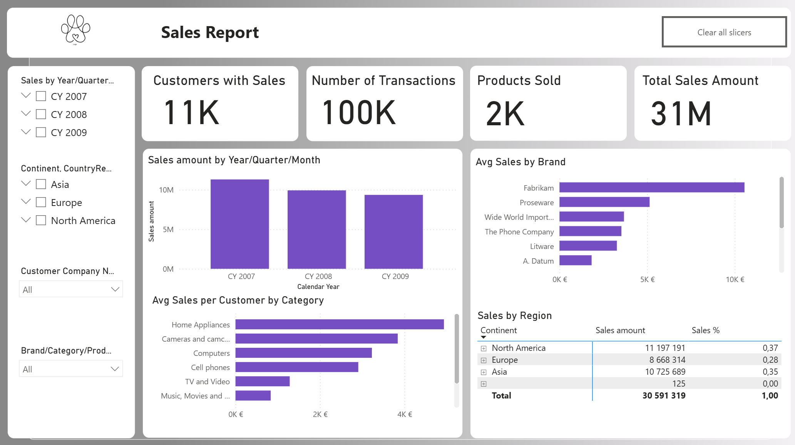

# Sales Report — Power BI Dashboard

## Project Overview
This project presents an interactive **Sales Dashboard** built in **Power BI**.  
The goal was to analyze sales performance across time, regions, brands, and product categories, and to present key business metrics in a clear, executive-friendly layout.

Interactive dashboard presented here🔗 **[Sales_Report](https://drive.google.com/file/d/1YUYj4MmuKGqPKeM4GIX2BXcR7yr7wyH5/view?usp=sharing)**

---

## Business Questions Addressed
- How many customers, transactions, and products are involved in sales?
- What is the total sales amount?
- How do sales change over time (year / quarter / month)?
- Which brands and categories generate higher average sales per customer?
- How is sales distributed across regions?

---

## Key KPIs
- **Customers with Sales**
- **Number of Transactions**
- **Products Sold**
- **Total Sales Amount**

All KPIs are displayed using unified formatting for better readability and comparison.

---

## Dashboard Features
- KPI cards with consistent units and layout
- Time-based analysis (Year / Quarter / Month)
- Average sales per customer by **Brand** and **Category**
- Regional sales breakdown with percentage contribution
- Interactive slicers:
  - Time hierarchy
  - Brand / Category / Product
  - Continent / Country
  - Customer
- “Clear all slicers” button for quick reset
- Custom layout with rounded containers and accent color styling

---

## Tools & Technologies
- **Power BI Desktop**
- **DAX** (measures for totals, averages, percentages)
- Data modeling with fact and dimension tables
- UX-focused dashboard design
